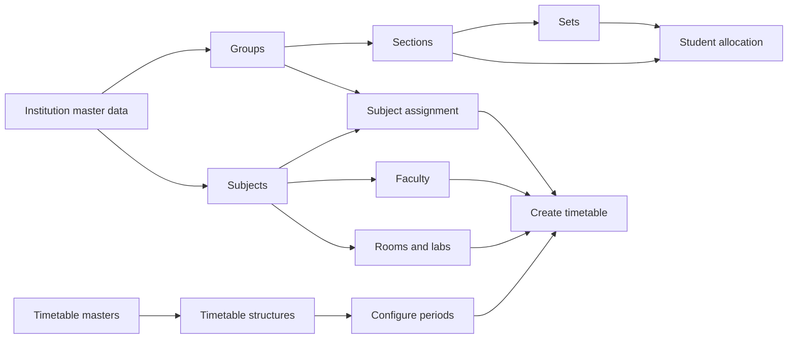

# Academics Admin UI/UX Design Specification

**Product:** GEU ERP Admin Console  
**Module:** `/admin/academics`  
**Document status:** Implementation-ready  
**Design direction:** Professional, compact, top-aligned, scalable, data-first  
**Audience:** Product, design, frontend, backend, QA and accessibility reviewers

---

## 1. Purpose

This document defines the complete visual, interaction and content system for every page in the Academics admin module. It is the source of truth for page hierarchy, typography, spacing, cards, forms, filters, tables, drawers, feedback, responsive behavior and empty states.

The Academics module must feel like one connected workspace. Administrators should not have to relearn layout or interaction patterns when moving from Groups to Subjects, Faculty, Rooms, Allocation or Timetables.

### Primary outcomes

1. Make frequent administrative work fast and predictable.
2. Keep all pages aligned from the top of the viewport.
3. Show records first; open creation and editing workflows only when requested.
4. Keep filters inside a consistent **Filters** popover or drawer.
5. Present large academic datasets in compact, readable tables.
6. Make dependencies between academic records understandable.
7. Use the global admin illustration library for empty and guidance states.
8. Support desktop, laptop, tablet and mobile without hiding essential actions.

### Out of scope

- Changing academic business rules or API contracts.
- Student-side academic pages.
- Building a separate design system that conflicts with existing ERP tokens.
- Decorative animations that slow down daily administrative work.

---

## 2. Current Route Inventory

| Route                                   | Page label           | Page type                   | Primary job                                               |
| --------------------------------------- | -------------------- | --------------------------- | --------------------------------------------------------- |
| `/admin/academics/groups`               | Groups               | Collection                  | Define programme cohorts for a session and semester       |
| `/admin/academics/sections`             | Sections             | Collection                  | Map sections to one or more groups                        |
| `/admin/academics/sets`                 | Sets                 | Collection                  | Create smaller teaching or elective sets inside a section |
| `/admin/academics/subjects`             | Subjects             | Collection + complex editor | Configure subjects, credits, hours, marks and visibility  |
| `/admin/academics/faculties`            | Faculty              | Collection                  | Manage faculty academic scope, subjects and availability  |
| `/admin/academics/rooms`                | Rooms and labs       | Collection                  | Manage teaching spaces, capacity and supported subjects   |
| `/admin/academics/student-allocation`   | Student allocation   | Task workspace              | Assign approved students individually or through CSV      |
| `/admin/academics/subject-assignment`   | Subject assignment   | Task workspace              | Assign required or elective subjects to a group           |
| `/admin/academics/timetable-masters`    | Timetable masters    | Collection                  | Define timetable containers by institution and session    |
| `/admin/academics/timetable-structures` | Timetable structures | Collection                  | Define working days and number of periods                 |
| `/admin/academics/timetable-periods`    | Configure periods    | Configuration workspace     | Configure period type, start time and duration            |
| `/admin/academics/timetables`           | Create timetable     | Interactive builder         | Assign subjects, faculty and rooms to timetable slots     |

`/admin/academics` redirects to `/admin/academics/groups`.

---

## 3. Information Architecture and Workflow Order

The sidebar may keep all routes visible, but it must communicate setup order through grouping and subtle labels.



### Sidebar grouping

Use three labeled groups inside the expanded Academics navigation:

1. **Academic structure** — Groups, Sections, Sets, Subjects, Faculty, Rooms and labs.
2. **Assignments** — Student allocation, Subject assignment.
3. **Timetable** — Timetable masters, Timetable structures, Configure periods, Create timetable.

Group labels use caption text and are not clickable. The active item uses the platform’s blue left edge, white active surface and blue icon. Sidebar icon positions must remain fixed during expand and collapse.

---

## 4. Global Page Shell

Every Academics page follows the same vertical order:

1. Global admin header and breadcrumb.
2. Page header.
3. Optional contextual KPI strip.
4. Collection toolbar or task selector card.
5. Main table/workspace.
6. Pagination or completion guidance.

### Desktop measurements

| Property                | Specification                                                |
| ----------------------- | ------------------------------------------------------------ |
| Content maximum width   | `1480px` using `--erp-admin-workspace-max-width`             |
| Horizontal page padding | `24px`                                                       |
| Tablet page padding     | `16px`                                                       |
| Mobile page padding     | `12px`                                                       |
| Page section gap        | `24px` desktop, `16px` tablet/mobile                         |
| Header height           | `68px`                                                       |
| Main content alignment  | Top aligned; never vertically centered                       |
| Main content scrolling  | `overflow-y: auto`, `min-height: 0`, stable scrollbar gutter |
| Background              | `--erp-canvas` (`#f7faff`)                                   |

### Page header

The page header is compact and uses a single horizontal row on desktop.

```text
Academics / Groups

Groups                                      [+ Create group]
Organise students by institution, session and semester.
```

- Title: 20px/28px, weight 700.
- Description: 14px/20px, muted.
- Title-to-description gap: 4px.
- Header bottom margin: 20px.
- Primary action: right aligned, 40px high.
- On mobile, title and action stack; action becomes full-width only below 480px.
- Do not add an oversized hero card behind ordinary page titles.

---

## 5. Typography

Use the existing platform stack:

```css
font-family:
  Inter,
  -apple-system,
  BlinkMacSystemFont,
  'Segoe UI',
  sans-serif;
```

| Role          | Size / line height | Weight | Colour               | Usage                       |
| ------------- | -----------------: | -----: | -------------------- | --------------------------- |
| Page title    |        20px / 28px |    700 | `--erp-text-heading` | One per page                |
| Section title |        16px / 24px |    600 | `--erp-text-heading` | Card and workspace titles   |
| Panel title   |        14px / 20px |    600 | `--erp-text-strong`  | Subsections and form groups |
| Body          |        14px / 20px |    400 | `--erp-text-body`    | Descriptions and guidance   |
| Label         |        13px / 18px |    600 | `--erp-text-strong`  | Form and filter labels      |
| Table         |        13px / 18px |    400 | `--erp-text-body`    | Table cells                 |
| Table primary |        13px / 18px |    600 | `--erp-text-strong`  | Main record value           |
| Caption       |        12px / 16px |    400 | `--erp-text-muted`   | IDs, metadata, help text    |
| KPI value     |        20px / 28px |    700 | contextual           | Summary values              |

### Copy rules

- Use sentence case: **Create group**, not **Create Group**.
- Use “Faculty” as the collective page title and “faculty member” for one person.
- Use “Room or lab” in form labels where either is accepted.
- Required labels end with `*`; never rely only on colour.
- Placeholders show expected content, not instructions already stated by the label.
- Avoid technical API words such as “record”, “resource” or “ID” unless the identifier is useful to the administrator.

---

## 6. Colour, Borders and Elevation

Use existing tokens rather than local hex values.

| Purpose                         | Token                    |
| ------------------------------- | ------------------------ |
| Primary action and active state | `--erp-blue-500`         |
| Primary hover                   | `--erp-blue-600`         |
| Page canvas                     | `--erp-canvas`           |
| Card surface                    | `--erp-surface`          |
| Subtle table header             | `--erp-surface-detail`   |
| Selected row                    | `--erp-surface-selected` |
| Default border                  | `--erp-border-default`   |
| Row divider                     | `--erp-border-subtle`    |
| Heading                         | `--erp-text-heading`     |
| Body                            | `--erp-text-body`        |
| Muted text                      | `--erp-text-muted`       |
| Success                         | `--erp-success-*`        |
| Warning                         | `--erp-warning-*`        |
| Error/destructive               | `--erp-danger-*`         |
| Informational                   | `--erp-info-*`           |

### Card treatment

- Radius: `12px`.
- Border: 1px solid `--erp-border-subtle`.
- Background: `--erp-surface`.
- Shadow: `--erp-shadow-card`; do not use large floating shadows for normal cards.
- Default padding: 16px.
- Header/footer borders: subtle 1px divider.
- Hover elevation is permitted only on clickable summary cards.

---

## 7. Core Page Patterns

### 7.1 Collection page

Use for Groups, Sections, Sets, Subjects, Faculty, Rooms, Timetable masters and Timetable structures.

```text
┌ Page title + description                           Primary action ┐
├ Optional compact KPI strip                                        ┤
┌ Collection card                                                   ┐
│ Search                 Filters (2)       Columns       Export     │
│ Active filters: Session: 2026–27 ×  Semester: 1 ×                │
├───────────────────────────────────────────────────────────────────┤
│ Compact data table                                                │
├───────────────────────────────────────────────────────────────────┤
│ Showing 1–25 of 248             25 / page       ‹ 1 2 3 ›         │
└───────────────────────────────────────────────────────────────────┘
```

Do not render the create/edit form permanently above the list. **Create** opens a right-side drawer. **Edit** opens the same drawer with existing values. This keeps the working dataset visible and reduces scrolling.

### 7.2 Task workspace

Use for Student allocation, Subject assignment and Configure periods.

- Show a compact scope selector card first.
- Reveal the task panel only when required parent selections are complete.
- Keep a summary of the selected scope visible as chips.
- Put the primary completion action in a sticky task footer when the workflow is long.

### 7.3 Interactive builder

Use for Create timetable.

- Scope controls stay in a collapsible top card.
- Timetable grid gets the majority of viewport space.
- Editing happens through a drawer or anchored popover, not a blocking center modal when desktop width allows.
- Save draft and Publish must be visually distinct.

---

## 8. Filters and Search

### Filter button

All structured filters live inside the global **Filters** control. Do not show a permanent row of select fields above the table.

- Button label: `Filters`.
- Show a numeric badge when filters are active.
- Desktop: anchored popover, 520–560px wide, opening below the button.
- Mobile/tablet: right drawer or bottom sheet.
- Popover starts near the top toolbar and must not be vertically centered.
- Footer remains visible with `Clear all`, `Cancel`, and `Apply filters`.

### Common Academics filters

Filters are cascading and populated from master data:

1. University.
2. College.
3. Department.
4. Course/level where applicable.
5. Branch.
6. Academic session.
7. Semester.
8. Status.

Child filters remain disabled until their parent is selected. Disabled fields include a short reason, for example “Select a university first”.

### Search

- Search field width: 320–360px desktop.
- Height: 40px.
- Search applies after 250–300ms debounce.
- Search placeholder is page-specific, e.g. `Search by group name or code`.
- `Escape` clears search when focused.
- No-results state distinguishes between an empty dataset and filters returning zero results.

---

## 9. Forms and Drawers

### Standard editor drawer

| Property       | Specification                                       |
| -------------- | --------------------------------------------------- |
| Width          | 520px standard, 680px for Subjects                  |
| Position       | Right side of content viewport                      |
| Header         | Sticky; title, short context, close button          |
| Body           | Independently scrollable                            |
| Footer         | Sticky; Cancel + primary Save                       |
| Backdrop       | `--erp-backdrop`                                    |
| Close behavior | Close icon, Escape and backdrop; confirm when dirty |

### Form layout

- Standard drawer: one column.
- Wide subject drawer: two columns for short numeric fields; long/select fields span both.
- Field vertical gap: 16px.
- Label-to-control gap: 6px.
- Control height: 40px desktop, 44px touch layouts.
- Inline help appears below the control in 12px muted text.
- Validation appears after blur or submit, directly below the affected field.
- First invalid field receives focus after failed submit.

### Cascading field behavior

When a parent changes, dependent selections are cleared and announced. Example:

`University → College → Department → Level → Course → Branch`

Never preserve a hidden or incompatible child value.

### Long forms

The Subjects form is divided into accordion groups:

1. Basic information.
2. Academic mapping.
3. Teaching load and credits.
4. Evaluation and marks.
5. Faculty entry permissions.
6. Student visibility.

Only the first group is open initially. Groups with errors open automatically.

---

## 10. Tables

### Base dimensions

- Header height: 40px.
- Default row: 52px where secondary metadata exists; 44px otherwise.
- Cell horizontal padding: 12px.
- Table font: 13px.
- Sticky table header for lists longer than one viewport.
- Horizontal scrolling occurs inside the table shell, never on the entire page.
- First meaningful column and Actions may become sticky on wide tables.

### Cell hierarchy

```text
Primary value          13px semibold
Secondary metadata     12px muted
```

### Row actions

- Use one vertical overflow button.
- Menu order: View, Edit/Configure, Duplicate if applicable, Delete.
- Destructive actions are red and separated by a divider.
- Never display multiple icon-only actions across every row.

### Selection

- Checkbox column width: 44px.
- Selecting rows replaces the standard toolbar with a bulk-action toolbar.
- Bulk action bar states the count, e.g. `12 students selected`.

### Pagination

- Left: `Showing 1–25 of 248 results`.
- Right: rows-per-page selector, previous, numbered pages, next.
- Default page size: 25.
- Preserve page, filters and search in query parameters.

---

## 11. Status, Loading and Feedback

### Status badges

Use compact 22px pills:

- Active/Configured/Published: green.
- Draft/Not configured: neutral or amber.
- Warning/Conflict: amber.
- Inactive/Unavailable: grey.
- Failed/Error: red.

### Loading

- Initial page load: table skeleton with 6–8 rows.
- Drawer save: button spinner and disabled footer actions; keep form visible.
- Filter refresh: table skeleton only; do not blank the page header.
- Timetable: skeleton grid preserving row and column geometry.

### Success

- Use a toast for completed create/update/delete actions.
- Copy includes the object name: `Group “B.Tech CSE A” created.`
- Update the table optimistically only when rollback is safe.
- Do not permanently consume page height with success banners.

### Error

- Field errors stay inline.
- Request errors appear in a dismissible alert above the affected card.
- Provide `Try again` for failed loads.
- Preserve entered values after recoverable save failures.

---

## 12. Global Illustration Usage

Use `erp-admin-illustration` with a semantic `kind`. Illustrations support content; they do not replace text.

This is a mandatory global UI/UX condition inherited from
`frontend/FRONTEND_UI_RULES.md`. Every Academics page must use the supplied
library for each relevant no-data, filtered-empty, unavailable, pending, upload,
configuration, history or scheduling state. A page is not implementation-complete
if it introduces one of these states with plain text or a locally copied image
when a matching registered illustration exists.

| Situation                    | Illustration kind   | Academics usage                             |
| ---------------------------- | ------------------- | ------------------------------------------- |
| No records configured        | `applicationForm`   | Groups, Sections, Sets, Subjects            |
| Search/filter returns zero   | `noResults`         | Every collection page                       |
| Setup waiting or incomplete  | `pendingReview`     | Timetable setup dependencies                |
| Schedule or period state     | `taskSchedule`      | Period configuration, timetable empty state |
| Reporting/inspection         | `analyticsSearch`   | Workload/room utilisation insights          |
| Previous assignments/history | `activityHistory`   | Allocation history                          |
| No compatible room           | `roomUnavailable`   | Timetable room conflict or empty room list  |
| CSV/file upload              | `documentUpload`    | Bulk student allocation                     |
| Master/integration setup     | `dataConfiguration` | Academic hierarchy missing                  |
| New student assignment       | `addStudent`        | Student allocation                          |

Sizing:

- Table empty state: 96px.
- Card empty state: 128px.
- Full-page setup guidance: maximum 192px.
- Always use transparent WebP assets from `/assets/images/admin-illustrations/`.
- Decorative illustrations use empty `alt`; the adjacent heading and description communicate the state.

---

## 13. Page-by-Page Specifications

### 13.1 Groups

**Header**

- Title: `Groups`.
- Description: `Organise students by institution, session and semester.`
- Primary action: `Create group`.

**Optional KPI strip**

- Total groups.
- Active sessions represented.
- Departments represented.

**Filters**

University, College, Department, Course/level, Branch, Academic session, Semester, Status.

**Table columns**

1. Group name.
2. Session.
3. Semester.
4. Institution.
5. Departments.
6. Courses and branches.
7. Status.
8. Actions.

**Create/edit drawer**

Institution → academic period → mapping → name. Generate a suggested name only as editable assistance. Show a compact mapping summary before Save.

**Empty state**

`applicationForm`, heading `No groups created`, description `Create the first academic group for the selected session and semester.`

---

### 13.2 Sections

**Header**

- Title: `Sections`.
- Description: `Create teachable sections and map them to academic groups.`
- Primary action: `Create section`.

**Filters**

Academic session, Semester, Group, Status.

**Table columns**

Section name, Mapped groups, Session, Semester, Student count, Set count, Status, Actions.

**Drawer**

Session and Semester appear before the Groups multi-select. Display selected groups as removable chips. Explain: `A section can serve multiple compatible groups.`

**Empty state**

`applicationForm`, with direct action to create a section. If no groups exist, use `dataConfiguration` and link to Groups instead.

---

### 13.3 Sets

**Header**

- Title: `Sets`.
- Description: `Create smaller teaching groups within a section.`
- Primary action: `Create set`.

**Filters**

Academic session, Semester, Group, Section, Status.

**Table columns**

Set name, Group, Section, Session, Semester, Allocated students, Assigned subjects, Status, Actions.

**Drawer**

Cascading order: Session → Semester → Group → Section → Set name. Show the current section capacity and allocated count if available.

---

### 13.4 Subjects

**Header**

- Title: `Subjects`.
- Description: `Manage curriculum, teaching load, evaluation and student visibility.`
- Primary action: `Create subject`.
- Secondary action: `Import subjects` when backend support exists.

**KPI strip**

Total subjects, Theory, Practical/lab, Electives.

**Filters**

University, College, Department, Course, Branch, Subject type, Subject option, Evaluation type, Status.

**Table columns**

Subject/code, Type, Credits, L–T–P hours, Evaluation, Maximum/pass marks, Academic mapping, Status, Actions.

Use `L–T–P: 3–1–2` rather than three wide columns.

**Editor**

Use the 680px grouped drawer described in Section 9. Add computed validation:

- Pass marks cannot exceed maximum marks.
- Internal + external structure must be compatible with maximum marks.
- At least one department is required.
- Code must be unique within the institution scope.

Place visibility options in a dedicated group using switches with clear positive labels. Avoid a dense unstructured wall of checkboxes.

**Details view**

Clicking the subject name opens a read-only details drawer with curriculum mapping, evaluation breakdown, assigned groups, faculty and recent changes.

---

### 13.5 Faculty

**Header**

- Title: `Faculty`.
- Description: `Manage teaching scope, subject capability and weekly availability.`
- Primary action: `Add faculty member`.

**KPI strip**

Active faculty, Average weekly limit, Fully allocated, Availability conflicts.

**Filters**

University, College, Department, Subject, Available day, Workload state, Status.

**Table columns**

Faculty member, Department, Subjects, Available days, Weekly limit, Assigned hours, Workload, Status, Actions.

Use a small progress bar for `assigned / weekly limit`; amber at 80–100%, red only above the limit.

**Drawer**

Name, Code, Email, Institution, Departments, Subjects, Available days, Weekly workload limit. Email errors use plain language.

---

### 13.6 Rooms and Labs

**Header**

- Title: `Rooms and labs`.
- Description: `Manage teaching spaces, capacity and subject requirements.`
- Primary action: `Add room or lab`.

**KPI strip**

Total spaces, Classrooms, Labs, Total capacity.

**Filters**

University, College, Building, Floor, Room type, Capacity range, Supported subject, Status.

**Table columns**

Room/code, Type, Building/floor, Capacity, Supported subjects, Current usage where available, Status, Actions.

**Empty/conflict states**

- No rooms: `roomUnavailable`.
- No filtered results: `noResults`.
- Timetable has no compatible room: use `roomUnavailable` in the assignment drawer with a link to this page.

---

### 13.7 Student Allocation

This is a task workspace, not a normal create form.

**Header**

- Title: `Student allocation`.
- Description: `Assign approved students to groups, sections and sets.`
- Primary action: `Import CSV`.

**Step 1 — Scope selector**

Session → Semester → Group → Section → Set. Show current capacity and allocation count.

**Step 2 — Student selection**

- Search by name, student ID, application ID or programme.
- Filters remain inside the Filters control.
- Table supports multi-selection.
- Columns: Student, ID, Programme, Current allocation, Admission status, Conflict, Selection.

**Step 3 — Review**

A right-side review panel shows target scope, selected count, duplicates, conflicts and valid assignments. Primary action: `Assign 24 students`.

**CSV flow**

1. Download template.
2. Upload via drop zone using `documentUpload`.
3. Validate rows.
4. Show Ready, Warning and Error tabs with counts.
5. Import valid rows.
6. Show completion summary and downloadable error file.

Never place a small native file input alone in a generic card.

---

### 13.8 Subject Assignment

**Header**

- Title: `Subject assignment`.
- Description: `Assign required and elective subjects to an academic group.`
- Primary action: `Review assignments` when selections exist.

**Layout**

Desktop uses a two-column workspace:

- Left 60%: searchable subject catalogue with filters and checkboxes.
- Right 40%: sticky selected-subject panel.

Scope selector sits above both columns: Session → Semester → Group.

**Subject catalogue card**

Each row shows code, name, type, credits, L–T–P and current assignment state. Required/elective is selected per subject or applied through a bulk control.

**Review and save**

Display additions, removals and unchanged assignments separately. Primary copy: `Save subject assignments`.

---

### 13.9 Timetable Masters

**Header**

- Title: `Timetable masters`.
- Description: `Define timetable containers for an institution and academic session.`
- Primary action: `Create timetable master`.

**Filters**

University, College, Academic session, Status.

**Table columns**

Timetable name, Institution, Session, Structures, Configured periods, Published timetables, Status, Actions.

**Drawer**

University → College → Academic session → Name. After creation, success toast provides `Configure structure` as a contextual next action.

---

### 13.10 Timetable Structures

**Header**

- Title: `Timetable structures`.
- Description: `Define working days and daily period capacity.`
- Primary action: `Create structure`.

**Filters**

Timetable master, Institution, Session, Working-day count, Status.

**Table columns**

Structure name, Timetable, Working days, Periods/day, Configured periods, Completeness, Status, Actions.

**Drawer**

Timetable master, Structure name, Number of periods, Working days. Working days use selectable weekday chips rather than a large dropdown.

Show configuration progress, for example `6 of 8 periods configured`.

---

### 13.11 Configure Periods

**Header**

- Title: `Configure periods`.
- Description: `Set lecture and break timings for each timetable structure.`

**Scope card**

Timetable master → Structure. Once selected, render every period as a vertical ordered list.

**Period list**

Each compact row contains:

- Drag handle or period number.
- Type: Lecture or Break.
- Start time.
- Duration.
- Calculated end time.
- Configuration status.
- Edit action.

Editing may be inline on desktop and a bottom sheet on mobile. Calculate downstream start times when permitted, but always preview affected periods before applying a bulk shift.

**Actions**

`Save draft` secondary and `Save configuration` primary. Warn about overlaps and gaps before save.

**Empty state**

If no structure exists, show `taskSchedule` with a link to Timetable structures.

---

### 13.12 Create Timetable

**Header**

- Title: `Create timetable`.
- Description: `Assign subjects, faculty and rooms across the weekly schedule.`
- Actions: `Save draft`, `Publish timetable`.

**Scope selector**

Session, Semester, Group, Section, Timetable master and Structure. Present in a compact 3-column desktop grid. After opening, collapse into a single summary bar with `Change scope`.

**Timetable toolbar**

- Current structure and status.
- Assigned slot count.
- Conflict count.
- View toggle: Week / Faculty / Room when data supports it.
- Undo and redo if editing is client-staged.

**Grid**

- First column: 112px sticky day labels.
- Period columns: minimum 144px.
- Header shows Period number and time.
- Slot minimum height: 96px.
- Assigned slot shows subject code/name, faculty, room and class type.
- Empty slot has a visible `+ Assign` affordance; right-click remains an accelerator, never the only method.
- Break slots use a soft blue patterned fill and are non-editable from the assignment action.
- Merged slots clearly span columns.
- Horizontal scrolling stays inside the grid.

**Slot editor drawer**

Shows Day/Period context, Subject, Faculty, Room/lab, Class type and duration/span. Filter faculty and rooms to compatible choices, but allow administrators to view why options are unavailable.

**Conflict handling**

Check faculty, room, section and time overlap. Conflicted slots receive an amber outline and warning badge. Publishing is blocked only for defined critical conflicts, with a summary linking to each slot.

**Publishing**

Publish opens a review dialog containing scope, slot coverage, unassigned lecture slots, warnings and effective date. The destructive reverse action is `Unpublish`, not Delete.

---

## 14. Responsive Design

### Large desktop: 1280px and above

- Full sidebar behavior.
- One-line page header.
- Toolbars remain horizontal.
- Collection tables show all essential columns.
- Drawers open without covering the sidebar.

### Tablet/small laptop: 768–1279px

- Hide lower-priority table columns using the Columns configuration.
- Toolbar may wrap into two rows.
- Filter opens as right drawer.
- Form drawers occupy 70–80vw, capped by their desktop maximum.
- Timetable keeps internal horizontal scrolling.

### Mobile: below 768px

- Page header stacks.
- Search takes full width; Filters and Columns remain separate buttons below.
- Collection rows may become compact record cards only when a table would be unusable.
- Drawers become full-screen sheets.
- Sticky footer actions respect safe-area insets.
- Touch targets are at least 44×44px.
- Do not shrink desktop tables until text becomes unreadable; use internal horizontal scrolling.

---

## 15. Accessibility

- Meet WCAG 2.2 AA contrast.
- Every control has a visible label.
- Focus indicators use `--erp-focus-outline` and `--erp-focus-ring`.
- Keyboard order follows the visual order.
- Drawers and dialogs trap focus and restore it to their trigger.
- Escape closes the topmost dismissible layer.
- Status never relies on colour alone.
- Table headers use correct `<th scope>` semantics.
- Sort direction uses `aria-sort`.
- Filter badges have an accessible label such as `2 filters applied`.
- Dynamic save, import and publish messages use an appropriate live region.
- Timetable cells are keyboard focusable and support Enter/Space to assign.
- Decorative illustrations use `alt=""` or `aria-hidden="true"`.
- Respect `prefers-reduced-motion`; no essential meaning depends on animation.

---

## 16. Motion and Interaction Timing

| Interaction        |                           Duration |
| ------------------ | ---------------------------------: |
| Button/row hover   |                          140–180ms |
| Popover enter/exit |                          180–220ms |
| Drawer enter/exit  |                              280ms |
| Sidebar expansion  | Existing global 1000ms requirement |

Use standard easing tokens. Avoid scaling cards on hover. Motion should reinforce where content came from, not call attention to itself.

---

## 17. Data and URL State

The following state should survive refresh and browser navigation through query parameters where practical:

- Search query.
- Applied filters.
- Page number and page size.
- Sort key and direction.
- Selected academic session and semester in task workspaces.
- Timetable scope after it has been opened.

Do not place unsaved form values in the URL. Use a dirty-state guard for drawers and the timetable editor.

---

## 18. Performance Requirements

- Lazy-load route components.
- Debounce search and avoid refetching unchanged filter combinations.
- Use server-side paging when record counts exceed the client-safe threshold.
- Virtualise long select lists and student allocation tables.
- Load the illustration only when its state is rendered.
- Keep WebP illustrations below 100KB where possible.
- Avoid rendering all timetable slot editors at once.
- Preserve table dimensions during loading to prevent layout shift.

---

## 19. Recommended Shared Components

The implementation should reuse or extend these global patterns:

| Component/pattern           | Academics responsibility                           |
| --------------------------- | -------------------------------------------------- |
| `erp-admin-page`            | Page title, description, actions and top alignment |
| `erp-filter-popover`        | Cascading academic filters                         |
| `erp-compact-action-menu`   | Consistent row actions                             |
| `erp-multi-select-dropdown` | Departments, groups, subjects and days             |
| `erp-admin-illustration`    | Semantic empty/guidance illustrations              |
| Standard editor drawer      | Create/edit workflows                              |
| Standard table shell        | Search, filters, columns, results and pagination   |
| Confirm dialog              | Delete, unpublish and risky bulk operations        |
| Toast service               | Non-blocking success and request feedback          |

Avoid copying page-local versions of these patterns.

---

## 20. Implementation Sequence

1. Create a shared Academics collection shell and filter schema.
2. Convert Groups, Sections and Sets to the collection + drawer pattern.
3. Implement the grouped Subjects editor.
4. Convert Faculty and Rooms with KPI summaries.
5. Redesign Student allocation, including CSV validation.
6. Redesign Subject assignment as a two-panel task workspace.
7. Convert timetable master and structure collections.
8. Redesign period configuration as an ordered period editor.
9. Upgrade the timetable grid, slot editor and publishing review.
10. Complete responsive, accessibility and state testing across all routes.

Each phase must use real API data and preserve existing business validation.

---

## 21. Definition of Done

An Academics page is complete only when:

- [ ] Content begins at the top and the page scrolls when needed.
- [ ] Header, title, description and actions match this hierarchy.
- [ ] Creation forms are not permanently displayed above collection tables.
- [ ] All structured filters are inside the Filters control.
- [ ] Search, filters, sort and pagination work together.
- [ ] Tables have professional density and internal overflow.
- [ ] Empty, loading, filtered-empty, error and success states are designed.
- [ ] The correct global illustration is used.
- [ ] Create, edit, delete and bulk actions provide clear feedback.
- [ ] Cascading fields clear incompatible child values.
- [ ] Keyboard, focus and screen-reader behavior is verified.
- [ ] Desktop, tablet and mobile layouts are verified.
- [ ] No hard-coded colours, fonts, asset paths or duplicated shared UI patterns are introduced.
- [ ] UI rule check, lint and production build pass.

---

## 22. Source References in This Repository

- Routes: `frontend/src/app/features/admin/admin.routes.ts`
- Sidebar navigation: `frontend/src/app/features/admin/layout/navigation/admin-navigation.config.ts`
- Current shared academic workspace: `frontend/src/app/features/admin/academics/academic-workspace.component.*`
- Current timetable builder: `frontend/src/app/features/admin/academics/timetable-builder.component.*`
- Global tokens: `frontend/src/style/_tokens.scss`
- Global system styles: `frontend/src/style/_system.scss`
- Illustration registry: `frontend/src/app/shared/ui/admin-illustration/admin-illustration.registry.ts`

This specification should be updated when an Academics route, workflow, business state or shared design token changes.
